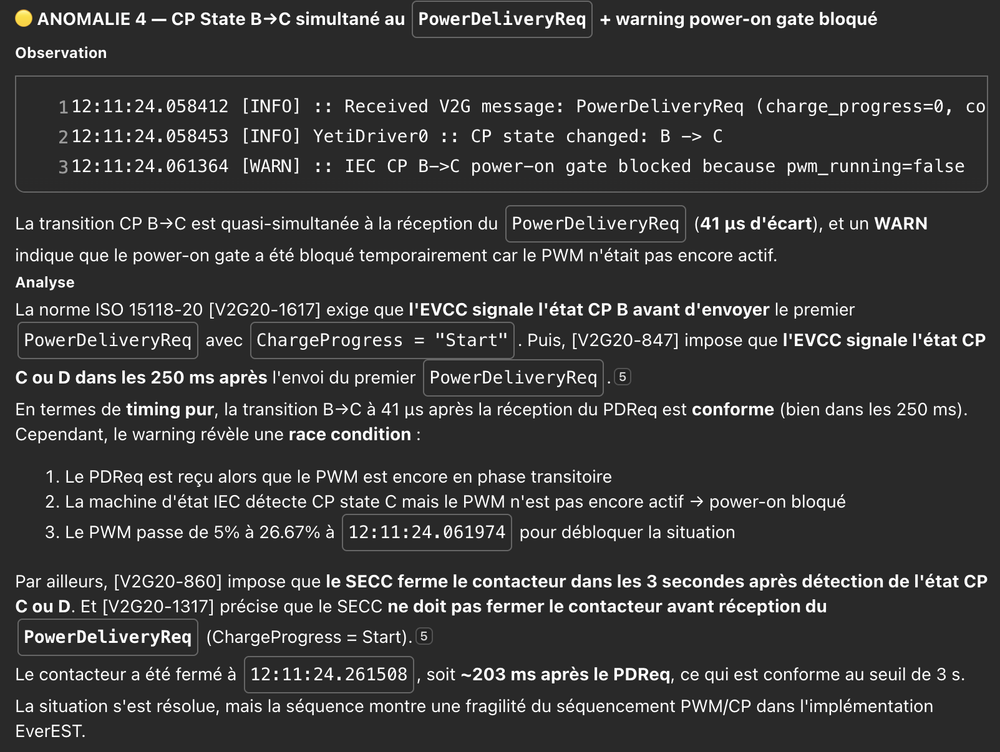

# Current Status of AC BPT V2G Charging with a Renault R5

As of 31/07/2026:  
This hotfixed version on branch `feat/tls-ecdh-curve-cert-match` work, and a -20 charging session wil start 100% of the time with a Renault R5.  
As I'm not a ISO15118 expert, current behavior of EVSE is probably NOT ISO15118-20 compliant.  

## Current weird behavior
| Behavior | Expected | Is it compliant to ISO15118?| 
| --- | --- | --- |
| TLS Handshake is way too long. Approximatly 5 seconds. | A standard TLS handshake shoud be less than 1 second. |  ❓ I guess so. |
| Negative timestamp in V2G message `AuthorizationSetupReq` (wth?) | Correct time of day in epoch format | ⛔️ |


# ISO15118 AI Expert observation 


Complaining about TIMING (due to the hotfix)

--- 
Hotfix [tls: handle CarRequestedPower and CarRequestedStopPower events in T_step_X1 state](https://github.com/Nyzeix/EVerest/commit/c7544c21a4860608600759cedbfaf78b199684cb) is a way to bypass this error. It must be rewrote.

---

# Build and run EVerest with Docker on macOS

## Why Docker is needed

The native macOS build stops while configuring `sdbus-cpp` because
`systemd`, `elogind` and `basu` are Linux libraries. EVerest therefore has to
be built and run inside the Linux development container.

This procedure uses the development environment already provided by the
repository. The repository is mounted read-write at `/workspace` inside the
container, so build artifacts remain available on macOS.

## Prerequisites

- Docker Desktop for macOS
- Docker Compose V2 (`docker compose`)
- A GitHub SSH key loaded in the macOS SSH agent

Check that Docker and the SSH agent are available:

```bash
docker --version
docker compose version
ssh-add -l
```

If `ssh-add -l` reports that the agent has no identities and no key exists,
create and load an Ed25519 key:

```bash
ssh-keygen -t ed25519 \
	-C "your-github-email@example.com" \
	-f ~/.ssh/id_ed25519

ssh-add --apple-use-keychain ~/.ssh/id_ed25519
pbcopy < ~/.ssh/id_ed25519.pub
```

Add the copied public key to GitHub, then verify the connection:

```bash
ssh -T git@github.com
```

The `devrd` script checks the SSH agent before generating
`.devcontainer/.env`, even when the current Git remote uses HTTPS.

## macOS GID workaround

On macOS, the primary group usually has GID `20` (`staff`). In the EVerest
Linux base image, GID `20` already belongs to `dialout`. A direct
`groupmod --gid 20 docker` therefore fails with:

```text
groupmod: GID '20' already exists
```

The local [development Dockerfile](.devcontainer/general-devcontainer/Dockerfile#L59)
handles this case by reusing the existing group when the requested GID is
already occupied. Keep this change when rebuilding the development image on
macOS.

## Build the development image

From the repository root:

```bash
cd /Users/paink/Projets/Renault/EVerest
./applications/devrd/devrd build
```

This builds the Linux development image and the helper images. It does not
compile EVerest itself yet.

## Start the SIL services

```bash
./applications/devrd/devrd start sil
```

This starts the development container, MQTT, Node-RED, MQTT Explorer and the
Docker proxy.

Available interfaces:

- Node-RED: <http://localhost:1880/ui>
- MQTT Explorer: <http://localhost:4000>

## Compile EVerest inside the container

Open a shell in the development container:

```bash
./applications/devrd/devrd prompt
```

Inside the container, use a separate build directory. The existing `build/`
directory may contain a CMake cache created on macOS and must not be reused:

```bash
cd /workspace

cmake -S . -B build-docker \
	-DCMAKE_BUILD_TYPE=Debug \
	-DCMAKE_INSTALL_PREFIX=/workspace/build-docker/dist

cmake --build build-docker \
	--target install \
	--parallel "$(nproc)"
```

The generated files are visible on macOS in:

```text
/Users/paink/Projets/Renault/EVerest/build-docker/
```

The files remain available after leaving the container because `/workspace`
is a read-write bind mount of the repository.

## Run the SIL simulation

Still inside the container, install the ISO 15118 Python dependencies and
start the predefined SIL configuration:

```bash
source /workspace/build-docker/venv/bin/activate
cmake --build /workspace/build-docker \
	--target iso15118_pip_install_dist

cd /workspace/build-docker
./run-scripts/run-sil.sh
```

In a second macOS terminal, from the repository root, select the matching
Node-RED flow:

```bash
cd /Users/paink/Projets/Renault/EVerest
./applications/devrd/devrd flow config/nodered/config-sil-flow.json
```

Then open <http://localhost:1880/ui> to control the simulation.

## Leave and stop the environment

To leave the development shell:

```bash
exit
```

To stop the SIL services from the macOS host:

```bash
./applications/devrd/devrd stop sil
```

Stopping the containers does not remove `build-docker/` or any other files in
the repository. The `purge` command removes Docker containers, images and
volumes and should only be used when a complete Docker cleanup is intended.